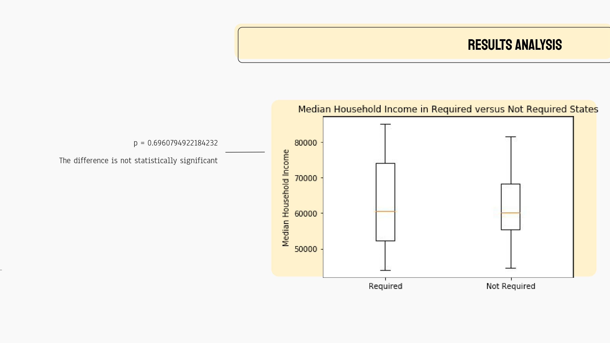

# Project 1 - Public School Kindergarten Effects on Student Success

* **Team Members**:
    - Aja Ould
    - Althea McMillian
    - Brittaney Marshall
    - Thomas Meacham
    

* **Project Description/Outline**: Attending Kindergarten is not a requirement of all states.  Our project will seek to discover how children’s performance in the states that require kindergarten compare to the performance of children in the states that do not require kindergarten attendance.

* **Research Questions to Answer**: 
    - What are the percentage of high school graduation, overall test scores and drop-out rates in the states that require kindergarten attendance?

    - What are the percentage of high school graduation, overall test scores and drop-out rates in the states that do not require kindergarten attendance?

    - Are the answers to the above questions impacted by house hold income and teacher to student ratios?
    

- - -
First, we graphed the graduation rates to visualize them. 

Then, we compared the graduation rates of states that required kindergarden versus states that do not require kindergarden. We also did the right version, which is the same information but with the outlier of removed. With either model, we found a p value that was greater than 0.05 and therefore the scores are not statistically significant. 

The next thing we looked at was test scores by subject: math, english and science. We found that in 4th grade, math and english scores are stastitically different, but not science scores. 

 * **Conclusion**: 
    - Overall, math and reading test scores are higher in states that do not require Kindergarden, as opposed to states that do, completely opposite to our initial hypothesis. 

    - There is no statistically significant difference in income between states that do and do not require kindergarden. 

    - There is no statistically significant difference in graduation rates between states that do and don't require kindergarden. 
